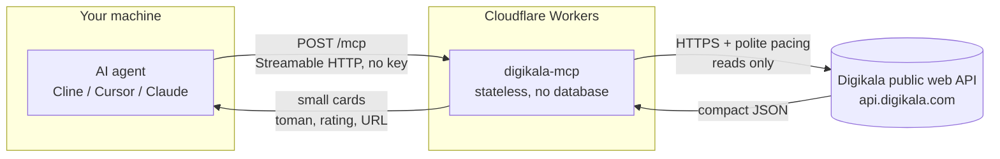

# Digikala MCP - Shop intelligence for AI agents


A public MCP server that gives AI agents **real Digikala knowledge**: search, **prices in Toman**, discounts, ratings, sellers, reviews, deals and bestsellers. **Read-only, no key needed.**

**Live endpoint:** `https://digikala-mcp.mmdju.workers.dev/mcp` (Streamable HTTP, stateless)

**[نسخه فارسی](README_FA.md)** · **[Examples](examples/sample-calls.md)** · **[Tool reference](docs/tools.md)** · **[Changelog](CHANGELOG.md)**

## Connect in 30 seconds

Any MCP client, **one URL**. Cline / Cursor / Claude Desktop (`mcp.json` style):

```json
{
  "mcpServers": {
    "digikala": { "url": "https://digikala-mcp.mmdju.workers.dev/mcp" }
  }
}
```

Then just talk: **"best Samsung phone under 20 million Toman"**, **"is this laptop any good?"**, **"what is on deal today?"**, **"what is popular in Iran right now?"**.

## 18 tools

| Tool | What it answers |
|---|---|
| `digikala_suggest` | Vague wording to **real search terms, category ids, trends** |
| `search_digikala` | "Show me X", price checks, filters + sorting + paging |
| `browse_category` | Browse a category, **drill into sub-categories** |
| `product_details` | Everything about one product: **price, seller, warranty, specs, reviews** |
| `product_price_chart` | "Is now cheap?" - **short price history with seller per point** |
| `product_questions` | "What did buyers ask?" - questions + answer counts |
| `get_products_batch` | Shortlist cards for **up to 10 ids** - feeds `compare_products` |
| `product_url` | Product id to **shareable URL** + title |
| `product_variants` | "Which colour is cheapest?" - **every variant with its own price + seller** |
| `search_filters` | "Which brands exist for X?" - **brand/color/category ids + price range** |
| `product_reviews` | "Is it any good?" - **buyer-only** and min-rating filters |
| `compare_products` | "Which of these?" - **only the specs that actually differ** |
| `find_best_value` | "Best X under Y Toman" - **ranked picks with seller grade** |
| `incredible_offers` | **Today's deals** (شگفت‌انگیز + other promotions) |
| `best_selling` | Site-wide bestsellers, with category ids to go deeper |
| `similar_products` | "What else is like this?" - Digikala's own recommendations |
| `find_real_price_drops` | Find real price drops from this install's D1 history |
| `price_history` | Show locally collected price snapshots for a product |

Notes for agent builders:

- **All prices are in Toman** (1 Toman = 10 Rial). Prices, stock and discounts **move constantly** - always link the product URL so the user can confirm before buying.
- Start vague queries with **`digikala_suggest`** to get real search terms and a `category_id`.
- Anything with a **budget** or the word **"best"** goes to **`find_best_value`** - plain search only sees one page.
- Product counts are **Digikala's own estimates** and drift between pages - treat them as approximate.
- Results are **capped** (default 10, max 30) to protect agent context. Specs are capped at 60 attributes unless narrowed.
- See **[examples/sample-calls.md](examples/sample-calls.md)** for seven copy-paste conversation flows, and **[docs/tools.md](docs/tools.md)** for the full parameter reference.
- Persian queries are normalized with [fa-text-utils](https://github.com/mmdju/fa-text-utils) (yeh/kaf folding, Persian digits, ZWNJ variants) - the same tiny helpers, published separately.

## How it works

How a question becomes an answer. No user data is stored anywhere in this path.



What this means:

- **Stateless.** Every request stands alone - no sessions, no accounts, nothing to log in to.
- **Read-only.** All 18 tools carry `readOnlyHint`. Nothing here can change, delete or order anything.
- **Price tracker fork.** This fork adds Cloudflare D1 storage plus an hourly Cron collector for deal prices.
- **No storage.** The only memory is a short-lived response cache (minutes, per isolate). Prices, stock and discounts are re-read from Digikala every time the cache expires.
- **Rate-limit aware.** Requests are paced and retried with backoff, so bursts never leave this box as bursts.
- **Undocumented upstream.** Digikala's public API can change without notice - this service tracks it and adapts, which is exactly why the [verify script](scripts/verify-live.mjs) exists.

## Trust, verified

Don't take my word for it - check the live server yourself:

```bash
node scripts/verify-live.mjs   # needs Node.js 18+, nothing to install
```

It lists the upstream 16 tools; this fork additionally exposes 2 local price-tracker tools, runs a search + details read + error paths, and asserts the honest-data contract. The same script runs **hourly in CI** ([](https://github.com/mmdju/digikala-mcp/actions/workflows/verify.yml)) - if the endpoint or Digikala's API drifts, the badge goes red. See [docs/architecture.md](docs/architecture.md) for how a question becomes an answer, and [examples/python.py](examples/python.py) for a copy-paste client.

## Data source

Digikala's public web API (**undocumented, may change without notice**). This project is **not affiliated with or endorsed by Digikala**.

## Status

**Free public service** on Cloudflare Workers. **Fair use applies** - if you hammer it, you will be rate-limited.

## Price Tracker fork

See `README_PRICE_TRACKER.md` for Cloudflare Worker + D1 deployment. The tracker currently uses the original public MCP endpoint as its upstream data source while keeping price history in your own D1 database.

## License

Showcase repository (**docs only, no source published**) - see [LICENSE](LICENSE). Security notes in [SECURITY.md](SECURITY.md). Persian version in [README_FA.md](README_FA.md).
